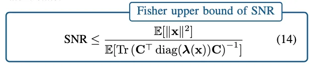

# Neuro-Fisher

This repository contains the implementation for the paper:

**Quantifying Signal-to-Noise Ratio in Neural Latent Trajectories via Fisher Information**. European Signal Processing Conference. EUSIPCO, Lyon, France.
*Hyungju Jeon, Il Memming Park*
[arXiv:2408.08752](https://arxiv.org/abs/2408.08752)

---

## Overview
Neural spiking activity is inherently stochastic, with significant variability across different trials and neurons. Yet, buried in this noise is critical information about the population-wide latent states, the hidden neural dynamics that drive and is driven by behavior and perception. To assess the feasibility of accurately extracting these latent states from a given dataset, we need statistical tools that help us understand how much information neural spikes carry.

> Given neural spiking recordings, how much do the neurons inform us about the latent neural states?  

To answer this question, we use the Fisher Information to derive an upper bound for the Signal-to-Noise Ratio (SNR) of the latent trajectories observed from spikes.

We model neural spiking activity of neuron $i$ at time $t$, $y_i(t) \in \mathbb{N}_0$, with a log-linear Poisson state space model\
$$y_i(t) \sim Poisson(\lambda_i(t))$$ 
where the firing rate $\lambda_i(t) \in \mathbb{R}^+$ is defined as exponential of a linear function of the latent trajectory $\mathbf{x}(t) \in \mathbb{R}^d$ and the observation model parameters (loading vector $C_i \in \mathbb{R}^{1 \times d}$ and bias $b_i \in \mathbb{R}$).\
$$ \lambda_i(t) = \exp(C_i \mathbf{x}(t) + b_i)$$

Then the Fisher Information of the latent trajectory given population of $n$ neurons is given by:\
$$ \boldsymbol{I}^{{\mathrm{pop}}}(\mathbf{x})=\mathbf{C}^{\top}\operatorname{diag}(\boldsymbol{\lambda}(\mathbf{x}))\mathbf{C} $$

where $\boldsymbol{\lambda}(\mathbf{x}) = (\lambda_1(\mathbf{x}), \lambda_2(\mathbf{x}), \ldots, \lambda_n(\mathbf{x}))^{\top}$ is the vector of firing rates for all neurons, and $\mathbf{C} = [C_1, C_2, \ldots, C_n]^{\top} \in \mathbb{R}^{n \times d}$ is the loading matrix.
Then we can derive the SNR of the latent trajectory using Cramér-Rao lower bound:


---

## Core Features
- Generate Poisson spike train observations and log-linear observation model parameters with controllable signal-to-noise ratio (SNR)
- Compute Instantaneous Observed Fisher Information 
- (To be implemented) Estimate Cramér-Rao lower bounds on estimation accuracy for the latent trajectory
- (To be implemented) Evaluate and compare inference results with theoretical uncertainty
---

## Installation

Clone and run from source:

```bash
git clone https://github.com/hyungju-jeon/neuro-fisher.git
cd neuro-fisher
```

```bash
pip install -r requirements.txt 
```
or 
```bash
conda env create -f environment.yml
```

---

## Usage

Generate Poisson spike train observations and log-linear observation model parameters with target signal-to-noise ratio (SNR) given a latent trajectory.

```python
observations, loading_matrix, bias, firing_rate_per_bin, snr = gen_poisson(
    x=latent_trajectory,
    C=None,
    d_neurons=num_neurons,
    tgt_rate_per_bin=target_rate_per_bin,
    max_rate_per_bin=max_rate_per_bin,
    priority="max",
    p_coh=p_coherence,
    p_sparse=p_sparse,
    tgt_snr=target_snr,
)
```
- `x` if the latent trajectory of interest. It should be normalized to have unit variance and zero mean. 
- `C` is the loading matrix. If `C` is provided, it will be used as the loading matrix but scaled to match the target signal-to-noise ratio (SNR) per bin. If `C` is not provided, it will be generated with target coherence and sparsity. 
- `d_neurons` is the number of neurons.
- `tgt_rate_per_bin` is the target mean firing rate per bin.
- `max_rate_per_bin` is the maximum firing rate per bin.
- `priority` can be "mean" or "max". "mean" prioritizes optimizing the mean firing rate per bin while "max" prioritizes the maximum firing rate per bin.
- `p_coh` and `p_sparse` are the target coherence and sparsity of the loading matrix.
- `tgt_snr` is the target signal-to-noise ratio (SNR) per bin. Suggested value of SNR bound is around `10 * log10(tgt_rate_per_bin * d_neurons / d_latent * 2 * log(max_rate_per_bin / tgt_rate_per_bin))`

Check out the demo folder for complete examples.

Demo for generating log-linear Poisson observations from GP latent trajectory given Fisher Information SNR bound:
```bash
python demo/simulate_observation_gp.py
```
and from 2D Ring latent trajectory:
```bash
python demo/simulate_observation_ring.py
```

## Citation

If you use this code in your research, please cite:

```bibtex
@InProceedings{Jeon2024b,
  author    = {Hyungju Jeon and Il Memming Park},
  booktitle = {European Signal Processing Conference},
  title     = {Quantifying signal-to-noise ratio in neural latent trajectories via {F}isher information},
  month     =  aug,
  year      = {2024},
  archivePrefix = "arXiv",
  primaryClass  = "q-bio.NC",
  eprint        = "2408.08752"
}
```
