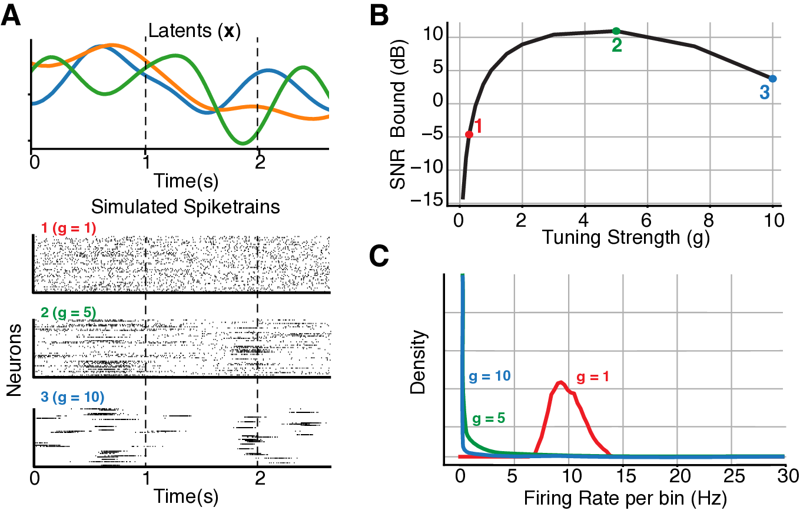

# Neuro-Fisher

This repository contains the implementation for the paper:

**Quantifying Signal-to-Noise Ratio in Neural Latent Trajectories via Fisher Information**  
*Hyungju Jeon, Il Memming Park*  
[arXiv:2408.08752](https://arxiv.org/abs/2408.08752)

## Abstract

Spike train signals recorded from a large population of neurons often exhibit low-dimensional spatio-temporal structure and modeled as conditional Poisson observations. The low-dimensional signals that capture internal brain states are useful for building brain machine interfaces and understanding the neural computation underlying meaningful behavior. We derive a practical upper bound to the signal-to-noise ratio (SNR) of inferred neural latent trajectories using Fisher information. We show that the SNR bound is proportional to the overdispersion factor and the Fisher information per neuron. Further numerical experiments show that inference methods that exploit the temporal regularities can achieve higher SNRs that are proportional to the bound. Our results provide insights for fitting models to data, simulating neural responses, and design of experiments.

---

## Overview and Core Features

- Generate Poisson spike train observations and log-linear observation model parameters with controllable signal-to-noise ratio (SNR)
- Compute Instantaneous Observed Fisher Information 
- (To be implemented) Estimate Cramér-Rao lower bounds on estimation accuracy for the latent trajectory
- (To be implemented) Evaluate and compare inference results with theoretical uncertainty

---

## Installation

Clone and run from source:

```bash
git clone https://github.com/hyungju-jeon/neuro-fisher.git
cd neuro-fisher
```

```bash
pip install -r requirements.txt 
```
or 
```bash
conda env create -f environment.yml
```

---

## Usage

Check out the demo folder for examples.

Demo for generating log-linear Poisson observations from GP latent trajectory given Fisher Information SNR bound:
```bash
python demo/simulater_obs_from_gp.py
```
and from 2D Ring latent trajectory:
```bash
python demo/simulater_obs_from_ring.py
```

## Citation

If you use this code in your research, please cite:

```bibtex
@article{jeon2024quantifying,
  title={Quantifying Signal-to-Noise Ratio in Neural Latent Trajectories via Fisher Information},
  author={Jeon, Hyungju and Park, Il Memming},
  journal={arXiv preprint arXiv:2408.08752},
  year={2024}
}
```
